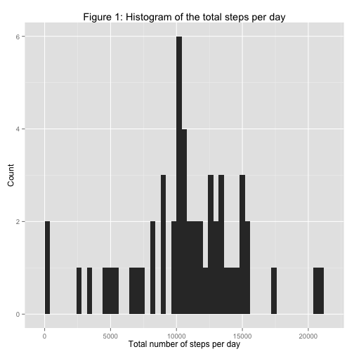
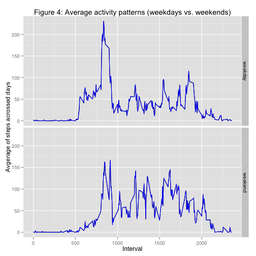

# 'Reproducible Research: Peer Assessment 1'
edited on 2015-02-05

This file is an assignment report for Peer Assignment 1 of Coursera course "Reproducible Research".

This assignment makes use of data from a personal activity monitoring device. This device collects data at 5 minute intervals through out the day. The data consists of two months of data from an anonymous individual collected during the months of October and November, 2012 and include the number of steps taken in 5 minute intervals each day.

The dataset is stored in a comma-separated-value (CSV) file and there are a total of 17,568 observations in this dataset. The three variables are included in the data set which are:   
    - steps: numeric, with missing values encoded as NA   
    - date: date, with format "YYYY-MM-DD"  
    - interval: integer  

## Loading and preprocessing the data
First of all, we unzip the data set, load it into a data frame. In order for analysis later on, we remove the NAs and convert it into a dplyr dataframe.


```r
# unzip the data
unzip("activity.zip")

# load the original data into a data frame
data_df <- read.csv("activity.csv")

# remove NAs for analysis
data_noNA <- data_df[complete.cases(data_df),]

# convert to dplyr dataframe format for better analysis
library(dplyr)
data_tbl_noNA <- tbl_df(data_noNA)

print(data_tbl_noNA)
```

```
## Source: local data frame [15,264 x 3]
## 
##    steps       date interval
## 1      0 2012-10-02        0
## 2      0 2012-10-02        5
## 3      0 2012-10-02       10
## 4      0 2012-10-02       15
## 5      0 2012-10-02       20
## 6      0 2012-10-02       25
## 7      0 2012-10-02       30
## 8      0 2012-10-02       35
## 9      0 2012-10-02       40
## 10     0 2012-10-02       45
## ..   ...        ...      ...
```

We could see that after removing NAs, there are 15,264 variables remaining. 

## What is mean total number of steps taken per day?

```r
# calculate and report mean, median & total number of steps per day
summary <- summarize(group_by(data_tbl_noNA,date), sumOfSteps=sum(steps))
mean_summary <- mean(summary$sumOfSteps)
median_summary <- median(summary$sumOfSteps)

# draw a histogram of the total number of steps taken each day (binwidth=400)
qplot(sumOfSteps, data=summary, geom="histogram", binwidth=400)+xlab("Total number of steps per day")+ylab("Count")+ggtitle("Figure 1: Histogram of the total steps per day")
```

 

The mean of the total steps taken per day is 1.0766189 &times; 10<sup>4</sup>. 
The median of the total steps taken per day is 10765.  
The distribution of the total number of steps taker per day is shown in Figure 1 as histogram.

## What is the average daily activity pattern?

```r
# draw a time series plot of the average daily activity pattern
summary2<-summarize(group_by(data_tbl_noNA,interval), avgOfSteps=mean(steps))
qplot(interval, avgOfSteps, data=summary2, geom="line") +xlab("Interval")+ylab("Avgerage of steps acrossed days")+ggtitle("Figure 2: Average daily activity pattern")
```

 

```r
# print out the interval with maximum number of average steps acrossed all the days
maxInterval <- summary2[which.max(summary2$avgOfSteps),1]
maxValue <- summary2[which.max(summary2$avgOfSteps),2]
```

The average daily activity pattern could be seen in Figure 2 above.   
At the interval 835, the maximum number of steps is reached, which is 206.1698113 steps.

## Imputing missing values

```r
# calculate and report the total number of missing values
num_of_na <- length(which(is.na(data_df)))

# create a new data set with missing data filled in by the mean of steps for that 5 minute interval
newData <- tbl_df(data_df) %>%
            group_by(interval) %>%
            mutate(steps = ifelse(is.na(steps), mean(steps,na.rm=TRUE), steps))

# calcuate and report mean and median
summary3 <- summarize(group_by(newData,date), sumOfSteps=sum(steps))
mean_summary3 <- mean(summary3$sumOfSteps)
median_summary3 <- median(summary3$sumOfSteps)

# make a histogram with missing data filled in
qplot(sumOfSteps, data=summary3, geom="histogram", binwidth = 400)+xlab("Total number of steps per day")+ylab("Count")+ggtitle("Figure 3: Total number of steps taken each day (with NAs filled in)")
```

 

The total number of row with NAs is 2304.

We then use the strategy described as follows to fill in all of the missing values in the original data set:   
- The NAs are filled in with the mean of steps for that 5 minute interval.  

The distribution of the total number of steps per day in the new data set is shown in Figure 3.

After analyzing the new data set, we get the following statistics:     
- the mean of the total steps taken per day (with NAs filled in) is 1.0766189 &times; 10<sup>4</sup>.     
- the median of the total steps taken per day (with NAs filled in) is 1.0766189 &times; 10<sup>4</sup>.   

From the results, we could see that, after filling in missing data, the mean of the total number of steps taken per day doesn't change, because the missing data takes the mean of steps for that 5 minut interval. However the median value is affected, because the distribution of the total daily number of steps changes by adding the missing data. 

## Are there differences in activity patterns between weekdays and weekends?


```r
# set the system language to English in case of error arised by ifelse(weekdays(...))
Sys.setlocale("LC_TIME", "C")
```

```
## [1] "C"
```

```r
# Create a new factor variable in the dataset with two levels – “weekday” and “weekend”
newData <- mutate(newData, dateType=ifelse(weekdays(as.Date(date)) %in% c("Saturday", "Sunday"), "weekend", "weekday"))
newData$dateType <- as.factor(newData$dateType)

summary4<-summarize(group_by(newData,interval,dateType), avgOfSteps=mean(steps))
qplot(interval, avgOfSteps, data=summary4, geom="line", facets=dateType~.)+xlab("Interval")+ylab("Avgerage of steps acrossed days")+ggtitle("Figure 4: Average activity patterns (weekdays vs. weekends)")+geom_line(color="blue")
```

 

From the Figure 4 derived from the data set, we could see that there exists differences in activity patterns between weekdays and weekends.

